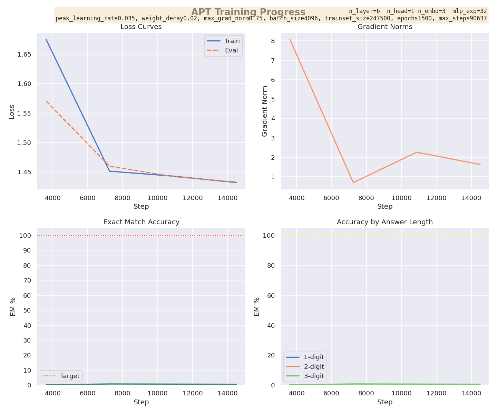

# Arithmetic Pretrained Transformer (APT)

A mechanistic interpretability study of how transformer models learn algorithmic arithmetic. This project investigates the internal representations and computational mechanisms transformers develop when trained on simple addition tasks.

## Training Progress



Current model achieves >95% exact match accuracy on 3-digit addition problems using a 4-layer transformer with minimal parameters.

## Architecture

The model implements a decoder-only transformer with the following specifications:

- **Positional encoding**: Learned embeddings
- **Vocabulary size**: 17 tokens (digits 0-9, '+', '=', special tokens)
- **Context length**: 11 tokens

At the time of writing, chosen hyperparameters include:
- **Layers**: 4 transformer blocks
- **Attention heads**: 2 per layer
- **Embedding dimension**: 4
- **MLP expansion factor**: 32x
Though these are highly likely to change further as I try to trim down from the ~5k parameters while maintaining ~95% accuracy.

Key architectural choices include RMSNorm for improved training stability and residual connection scaling (1/√(2n)) for deep layer initialization.

## Reproducing Results

### Installation

```bash
# Using uv (recommended)
uv sync

# Or using pip
pip install -r requirements.txt
```

### Training

Train the 3-digit addition model:

```bash
python apt_train_3digits.py
```

**Training hyperparameters:**
These too change a lot and will probably be different at the time of reading, though at the time of writing they are:
- Batch size: 2048
- Learning rate: 0.03 (with cosine annealing)
- Epochs: 300
- Weight decay: 0.01
- Gradient clipping: 0.5

Training logs are saved to `runs/` (TensorBoard format) and plots are generated asynchronously in `plots/current_run.png`.

### Evaluation

The model is evaluated on exact match (EM) accuracy, with metrics broken down by answer length (1-digit, 2-digit, 3-digit results). Evaluation runs every 2% of training steps using 1% of the dataset as a held-out validation set.

## Dataset

Training data consists of all addition problems from 0+0=0 to 499+499=998 (250,000 examples). Examples are formatted without BOS/EOS tokens:

```
0+0=0
1+2=3
499+499=998
```

Dataset is tokenized character-by-character with left-padding to 11 tokens.

## Project Structure

```
apt_train_3digits.py              # Main training script (3-digit addition)
apt_train_2digits.py              # Training script for 2-digit experiments
src/
  arithmetic_pretrained_transformer.py  # Core transformer implementation
  arithmetic_tokenizer.py               # Character-level tokenizer
  async_realtime_plots.py               # Asynchronous plotting utilities
datasets/
  no_bos_no_eos/499by499.json          # Training data
apt_checkpoints/base/                   # Saved model checkpoints
exploration_notebooks/                  # Analysis notebooks
```

## Mechanistic Interpretability Features

The model includes extensive debugging capabilities for mechanistic analysis:
- Attention weight extraction (`output_attentions=True`)
- Layer-by-layer activation printing
- Residual stream inspection
- Custom `apt_print()` method for token-aligned vector visualization

## Requirements

- Python >=3.11
- PyTorch 2.4.1
- transformers >=4.57.3
- Additional dependencies in `pyproject.toml`

## References

This work is inspired by:

- Nanda et al. (2023). "Progress Measures for Grokking via Mechanistic Interpretability"
- Karpathy, A. "NanoGPT" (https://github.com/karpathy/nanoGPT)

## AI Use
The core logic for setting up and training the transformer was all written by myself, using nanoGPT as a reference implementation. Claude 4.5 Opus helped me write the plotting code, some of the manim code, and this README. It also gave some advice on efficiencies (using native PyTorch dataloader) and implementation (swapping from nn.LayerNorm to nn.RMSNorm).


## Citation

```bibtex
@software{apt2024,
  title={Arithmetic Pretrained Transformer: A Mechanistic Study of Algorithmic Learning},
  author={Neel Rajani},
  year={2024},
  url={https://github.com/Neelectric/APT}
}
```
